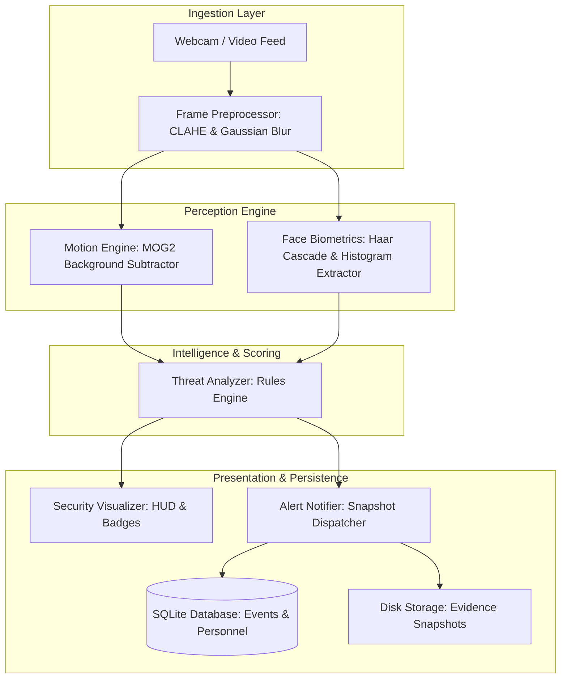
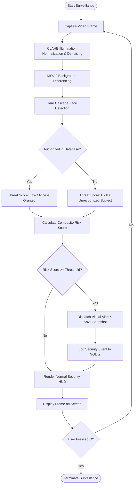
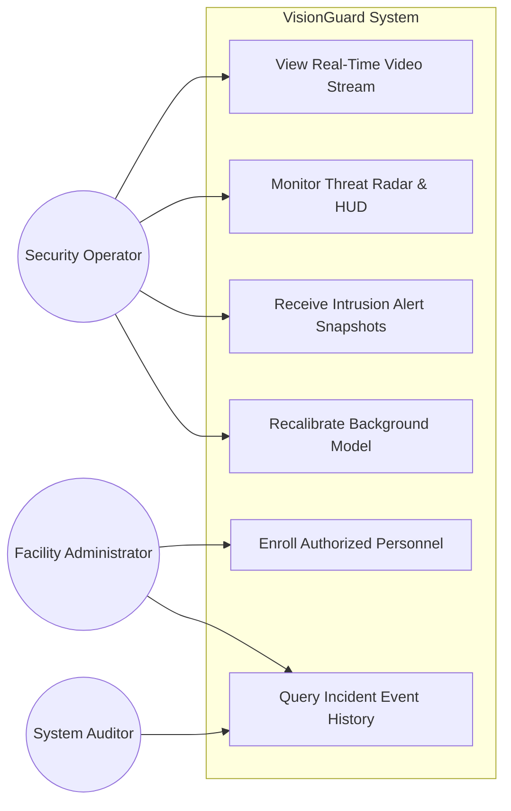
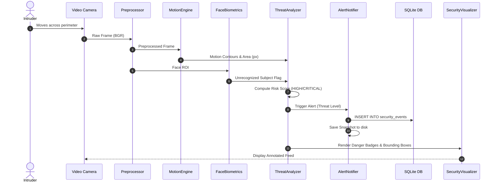
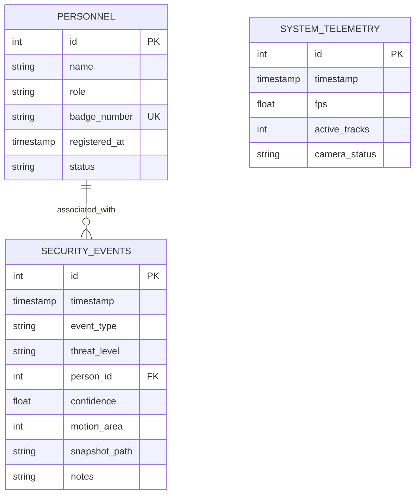

# VisionGuard System Architecture & Design Diagrams

## 1. System Architecture Diagram

## 2. Process Workflow Diagram

## 3. Use Case Diagram

## 4. Sequence Diagram: Security Event Detection & Alerting

## 5. Entity-Relationship (ER) Diagram

